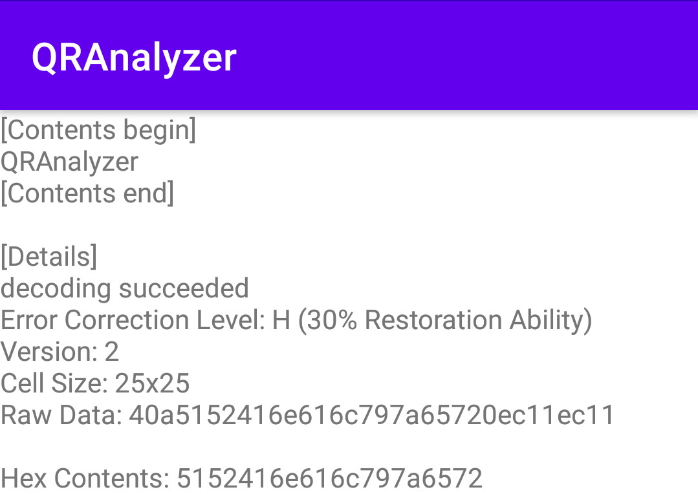
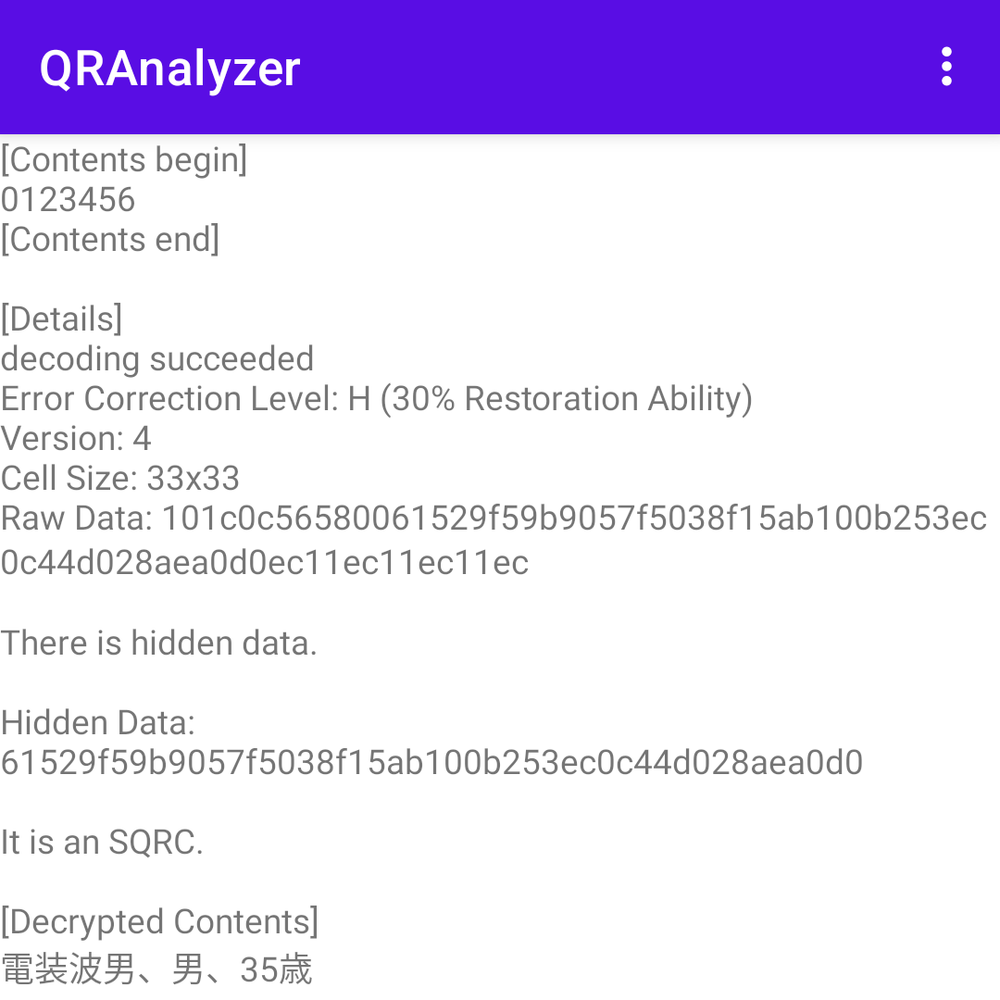

[日本語](README_JA.md)

# QRAnalyzer

Analyze QR code®

# Features

## Show Details

Show QR code® details.

## Show Hidden Data

Show Hidden data in the QR code®.

This is the only third-party reader that can read [SQRC®](https://www.denso-wave.com/en/system/qr/product/sqrc.html)

The SQRC® specifications are summarized in this article (Japanese).

[SQRC® の読み方 - OLIET の自由帳](https://blog.oliet.tech/?p=107)

# Licenses

See [licenses.xml](app/src/main/res/values/licenses.xml)

QR code, SQRC are registered trademarks of DENSO WAVE INCORPORATED.
