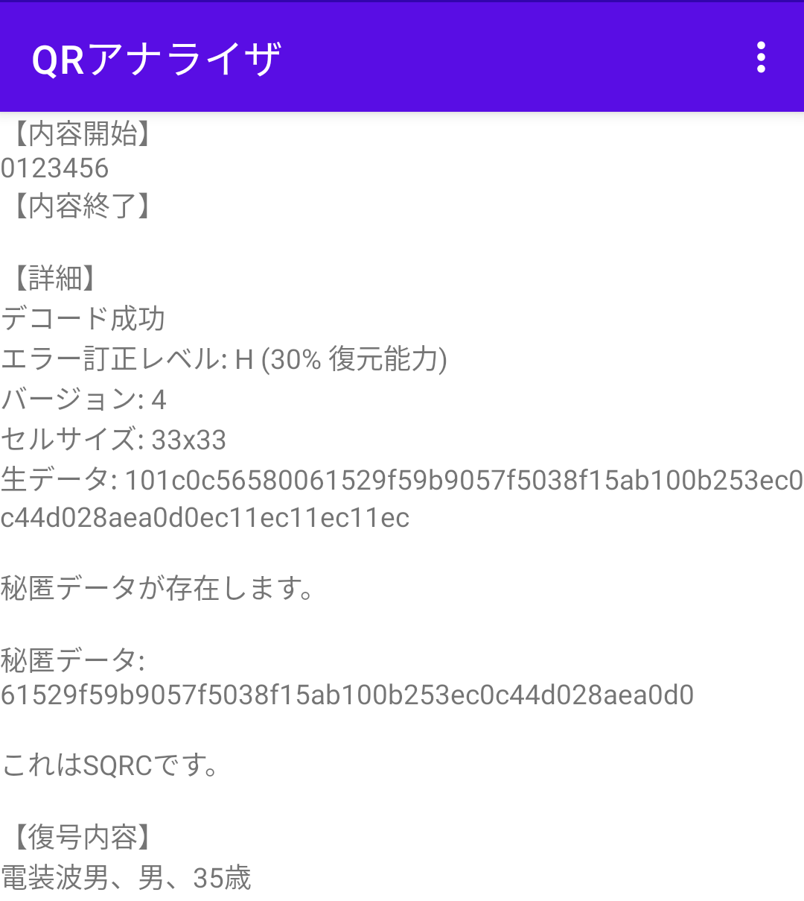

# QRAnalyzer

analyze QR code

## Show Details

## Show Hidden Data

[SQRC](https://www.denso-wave.com/en/system/qr/product/sqrc.html)

[SQRC](https://www.denso-wave.com/ja/system/qr/product/sqrc.html)

# Using Component

[ZXing Android Embedded](https://github.com/journeyapps/zxing-android-embedded) Licensed under the [Apache License 2.0](https://www.apache.org/licenses/LICENSE-2.0)
