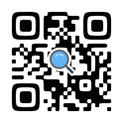

[English](README.md)

# QR アナライザ

QR コード ® を解析します

# 機能

## 詳細表示

QR コード ® の詳細を表示します。

## 秘匿データの表示

QR コード ® に隠されたデータを表示します。

これは[SQRC®](https://www.denso-wave.com/ja/system/qr/product/sqrc.html)を読み取ることができる唯一のサードパーティのリーダです。

SQRC® の仕様についてはこの記事にまとめています。

[SQRC® の読み方 - OLIET の自由帳](https://blog.oliet.tech/?p=107)

# Licenses

See [licenses.xml](app/src/main/res/values/licenses.xml)

QR コード、SQRC は㈱デンソーウェーブの登録商標です。
